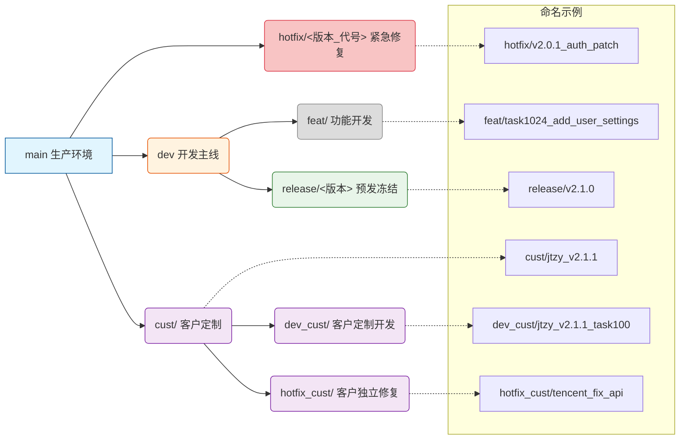

# Git Flow 开发协作简易指南

## 核心原则

*   **主线稳定：**
    
    *   `main` 仅接受来自 `**release**` **分支**的发布合并，以及来自 `hotfix` 分支的紧急修复。
        
    *   **严禁** `dev` 或其他任何功能开发分支直接合并入 `main`。
        
*   **闭环同步：**
    
    *   所有的线上紧急修复（Hotfix），**必须**反向同步回开发分支（`dev`）。
        
    *   同时，也需同步回当前**活跃的** `**release**` **分支**，以形成代码闭环，防止 Bug 在后续版本中复发。
        
*   **发布验证与锚定：**
    
    *   `**release**` **分支**是合并到 `main` 的唯一必经之路，负责集成测试和版本冻结。
        
    *   **在合并到** `**main**` **后，必须打上唯一的版本 Tag**，作为不可变的代码基线。
        
*   **客户隔离：**
    
    *   客户定制代码在专用分支（`cust`）维护，**并基于** `**main**` **上的稳定 Tag 拉出**。
        
    *   客户定制的通用功能需经过“重构/配置化”后才能回流主线（`dev`）。
        

## 全局流程图    

```mermaid
graph TB
  %% --- 定义节点 ---
  m["main 生产环境&#10;(Tag: v1.0, v1.1...)"] 
  d[dev 开发主线]
  
  %% 临时分支区
  r["release 发布分支&#10;(临时: release/v1.1)"]
  feat[feature 功能开发]
  h[hotfix 紧急修复]

  %% 客户定制区
  c["cust/client_A&#10;客户定制分支"]
  cd[dev_cust 客户定制开发]
  ch[hotfix_cust 客户独立修复]

  %% --- 核心迭代链路 ---
  %% 1. 开始迭代
  m ===> |1. 新迭代开始| d

  %% 2. 功能开发
  d ---> |新建| feat
  feat -.-> |开发/自测完成| d

  %% 3. 发布准备 (release流程)
  d ===> |2. 功能冻结/提测| r
  r -- 测试/修Bug --> r
  r ===> |3. 验证通过/合并| m
  r -.-> |"合并 (确保release修复同步)"| d

  %% 4. 正式发布
  m -.- |"4. 打标签 (tag: v1.1.0)"| m

  %% --- 线上热修 (Hotfix) ---
  m ---> |发现Bug| h
  h ---> |修复后合并| m
  h -.-> |"<font color=red>反向同步 (闭环)</font>"| d
  %% 注：如果有活跃的 Release 分支，Hotfix 也要同步给 Release，此处省略连线以防混乱

  %% --- 客户定制流程 ---
  %% 关键变更：客户分支基于 Main 的 Tag 拉出
  m ---> |"5. 基于 tag v1.1.0 创建"| c
  
  c ---> |定制需求| cd
  cd ---> |合并| c
  
  c ---> |客户Bug| ch
  ch ---> |修复| c

  %% --- 价值回流 ---
  cd -.-> |"<font color=blue>通用功能 (重构后)</font>"| d
  ch -.-> |"<font color=blue>底层通用Bug</font>"| d
  
  %% 样式定义
  style m fill:#e1f5fe,stroke:#01579b,stroke-width:2px
  style d fill:#fff3e0,stroke:#e65100,stroke-width:2px
  style r fill:#e8f5e9,stroke:#2e7d32,stroke-width:2px,stroke-dasharray: 5 5
  style c fill:#f3e5f5,stroke:#7b1fa2,stroke-width:2px
```



## 分支命名与严格合并策略

| **分支类型** | **命名模式** | **来源** | **主要合并去向** | **说明** |
| --- | --- | --- | --- | --- |
| **Main** | `main` | \- | \- | **生产环境基线**。代码必须经过测试。发布时**在合并后**打 Tag (如 `v1.0.0`)。只接受 `release` 和 `hotfix`。 |
| **Dev** | `dev` | `main` | `release` | **开发主线**。包含所有功能。永久存在。接受来自 `feat`、`hotfix` 和 `release` 的合并。 |
| **Release** | `release/<版本>` | `dev` | `main` & `dev` | **预发/版本冻结分支**。临时分支。从 Dev 切出后进行功能冻结和集成测试。**测试通过后，合并至 Main 和 Dev，并立即删除**。 |
| **Feature** | `feat/<禅道ID_描述_代号>` | `dev` | `dev` | **个人功能开发分支**。命名模式应关联禅道任务 ID。开发完合并回 `dev` **后删除**。 |
| **Hotfix** | `hotfix/<版本_代号>` | `main` | `main` & `dev` & `release` | **线上紧急修复**。唯一能直接碰 Main 的例外。**必须**同步回 `dev`。同步到 `release` 仅在 Release 分支活跃时进行。 |
| **Customer** | `cust/<name>` | **Main (tag)** | \- | **客户交付**。基于 Main 分支的稳定 **Tag**（例如 `v1.2.0`）拉出。维护客户定制代码。 |



## 关键协作流程规范

### 4.1 正常发版流程

日常最频繁的流程，严格遵循三级跳：`Dev` -> `Release` -> `Main`。

1.  **开发阶段：**
    
    *   开发者在 `feat/<JIRA_ID_描述>` 分支开发，**完成后合并入** `**dev**`。
        
2.  **提测与冻结阶段 (Dev -> Release)：**
    
    *   当 `dev` 完成本迭代所有功能后，从 `dev` **切出临时的** `**release/<版本>**` **分支**（例如 `release/v1.2.0`）。
        
    *   将 `release/<版本>` 部署到预发环境进行测试。
        
    *   **注意：** 从此刻起 `release` 分支进入**冻结期**，只做当前版本的查漏补缺和 Bug 修复，**严禁**加入新功能。
        
3.  **发布阶段 (Release -> Main)：**
    
    *   测试在 `release` 分支验证通过。
        
    *   发起 MR，将 `release` 分支**合并至** `**main**`。
        
    *   将 `release` 分支**反向同步合并至** `**dev**` (确保测试期间的 Bug 修复被带回开发主线)。
        
    *   在 `main` 上对本次合并点**打上 Tag**（遵循语义化版本，如 `v1.2.0`）。
        
    *   **发布完成后，立即删除** `**release/<版本>**` **分支。**
        

### 4.2 线上紧急修复

**场景：** `main` 出现严重 Bug，无法等待下一次 `dev` -> `release` 的流程。

1.  **动作：**
    
    *   从 `main` **切出** `**hotfix/<版本_代号>**` **分支**进行修复。
        
    *   **合并回 Main：** 修复完成后，发起 MR 快速合并回 `main` 并部署上线。
        
    *   **同步回 Dev (必选)：** 必须将 `hotfix` 同步合并回 `dev`，保证下个迭代包含此修复，防止 Bug 复发。
        
    *   **同步回 Release (条件)：** 如果当前存在正在进行测试的活跃 `release` 分支，也必须将 `hotfix` 同步到该 `release` 分支，以确保预发环境与线上同步。
        

### 4.3 客户分支管理策略

**核心优先原则：** **尽量引导客户使用** `**main**` **分支的标准功能，多用开关配置。**

**配置化原则：** 如果客户需要特殊逻辑，优先考虑做成“配置项”合并入 `dev` 主线，而不是在 `cust` 分支写死代码。

这是流程中最复杂的部分，必须遵从以下流程：

1.  **新建客户基线：**
    
    *   客户分支 `cust/<name>` **必须基于** `**main**` **的稳定 Tag**（例如 `v1.2.0`）创建。
        
2.  **定制开发：**
    
    *   在客户分支 `cust/<name>` 上创建临时的 `feat_cust/xxx` 分支开发，完成后合并回 `cust/<name>`。
        
3.  **基线升级与补丁同步策略：**
    
    *   **小补丁同步 (Hotfix)：** 当 `main` 上有紧急 Bug 修复时，由客户项目负责人评估，使用 `git cherry-pick <commit_id>` **按需**挑选并同步修复补丁至客户分支。[git cherry-pick 教程 作者： 阮一峰](https://www.ruanyifeng.com/blog/2020/04/git-cherry-pick.html)
        
    *   **核心版本升级：** 若客户需要升级核心功能版本（例如从 `v1.0` 升级到 `v1.2`），**应使用** `**git merge**` 将 `tag v1.2.0` 尝试合并到 `cust/<name>`，并手动解决合并冲突。此过程是为了保持 Git 历史的清晰继承关系。
        
4.  **价值回流：**
    
    *   如果客户分支上的定制功能具有通用价值，必须经过 **重构或配置化** 处理后，由 `feat_cust` 或 `dev_cust` 分支发起 MR，**合并回** `**dev**` **主线**。
        

## 提交与合并规范

#### 5.1 Commit Message 格式

Git 每次提交代码，都要写 Commit message（提交说明），否则就不允许提交。提交规范设置为：`type(scope): subject`。

**核心要求：**

*   **简洁可读：** 准确描述本次提交的目的，便于检索。
    
*   **关联任务：** 提交信息主体应包含对应的 **禅道 Issue ID**，以实现代码和任务的闭环。
    

**建议遵循 Conventional Commits 规范：**

| **Type** | **说明** | **示例** |
| --- | --- | --- |
| `feat` | **新功能** | `feat: 增加课程章节分级接口` |
| `fix` | **修补 Bug** | `fix(auth): 修复课程详情空指针报错` |
| `docs` | 文档修改 | `docs: 更新 README 中的部署步骤` |
| `style` | 格式修改（如代码风格、空白符，不影响代码运行） | `style: 移除多余的换行符` |
| `refactor` | 重构（即不是新增功能，也不是修改 bug） | `refactor(core): 优化配置加载逻辑` |
| `chore` | 构建过程或辅助工具的变动（例如：npm 配置，CI/CD 脚本修改） | `chore(deps): 升级 webpack 版本到 5.0` |
| `test` | 增加或修改测试用例 | `test: 增加用户注册功能的单元测试` |

**高级格式（推荐）：**

```plaintext
<type>(<scope>): <subject> [Bug-<IssueID>]

<body>

<footer>

```

**示例：**

```plaintext
fix(api): 增加课程章节分级接口 [Bug 1111]

为前端提供新的课程结构化数据，支持多级目录展示。

```

#### 5.2 Merge Request (MR) 准则

合并请求（Merge Request/Pull Request）是代码进入更高层级分支的唯一途径。

1.  **自测 (Mandatory)：**
    
    *   提交 MR 前，开发者**必须**在本地通过编译和基础自测（单元测试、集成测试），确保功能符合预期。
        
2.  **Review (Mandatory)：**
    
    *   MR 必须经过**至少 1 位**同事的 Code Review 才能合并。
        
    *   **Main 和 Release 分支**的 MR 必须由技术负责人**或**项目维护者最终批准。
        
3.  **描述与可追溯性：**
    
    *   MR 标题必须遵循 `type: subject [禅道指令 ID]` 格式。
        
    *   MR 描述中必须简要说明本次请求包含的**功能点、影响范围和测试结果**。
        
4.  **分支清理 (Cleanup)：**
    
    *   `feat` 和 `hotfix` 分支的 MR 合并完成后，**必须勾选删除源分支**选项。